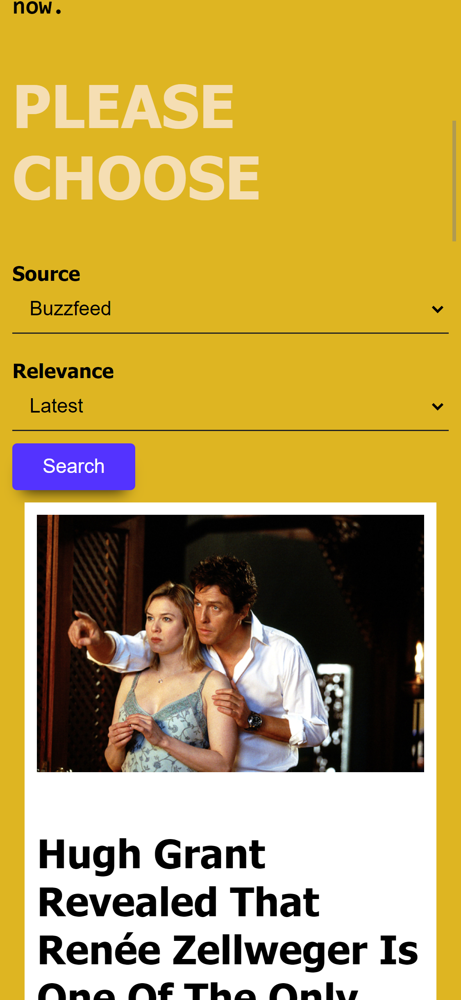

# Journal - Premium News Experience

[](https://reactjs.org/)
[](https://redux.js.org/)
[](https://styled-components.com/)

**Journal** (formerly **Get News**) is a high-end editorial-style news application designed for a sophisticated reading experience. It features a modern 12-column magazine layout, adaptive dark mode, and persistent article bookmarking.

[View Detailed Case Study](./CASE_STUDY.md)

## ✨ Features

- 📰 **Premium Magazine UI**: Responsive 12-column grid layout with Hero, Featured, and Compact article cards.
- 🌓 **Adaptive Dark Mode**: Seamless toggle between light (editorial warm) and dark (deep charcoal) themes.
- 📱 **Fully Responsive**: Optimized for all screen sizes from mobile to ultra-wide displays.
- 🔖 **Article Bookmarking**: Save stories to your personal reading list (persisted via localStorage).
- 🔍 **Real-time Search**: Search across 50+ news sources globally.
- ⚡ **Optimized Performance**: Fast loading with skeleton screens and resilient image handling.
- 🛠️ **Modern Tech Stack**: Rebuilt with React 18, Redux, and Material UI v6.

## 📸 Screenshots

<p align="center">
  
  
</p>

## 🚀 Getting Started

### Prerequisites
- Node.js (v18 or higher)
- NewsAPI Key (Get one at [newsapi.org](https://newsapi.org/))

### Installation

1. Clone the repository:
   ```bash
   git clone https://github.com/yourusername/journal.git
   cd journal
   ```

2. Install dependencies:
   ```bash
   npm install
   ```

3. Configure Environment Variables:
   Create a `.env` file in the root directory:
   ```env
   NEWS_API_KEY=your_api_key_here
   ```

4. Start the development server:
   ```bash
   npm start
   ```

## 🏗️ Architecture

- **Frontend**: React 18 using the new `createRoot` API and Functional Components.
- **Styling**: `styled-components` v6 for theme-based CSS-in-JS and MUI v6 for icons.
- **State Management**: Redux with `redux-thunk` for asynchronous operations.
- **Backend Proxy**: Serverless functions (`api/news.js`) to secure API requests and bypass production CORS restrictions.

## 🧪 Testing & Verification

Run the unit test suite:
```bash
npm test -- --watchAll=false
```

Generate a production-ready build:
```bash
CI=true npm run build
```

## 📄 License
[MIT](https://choosealicense.com/licenses/mit/)
